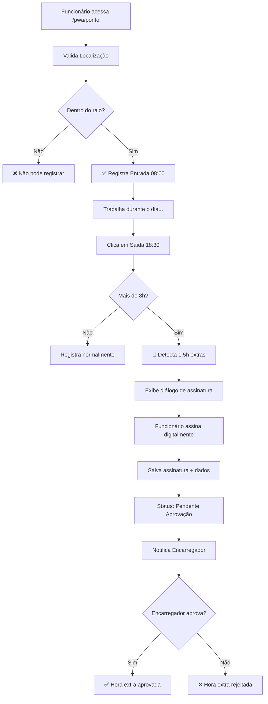

# 📍 Funcionalidades de Geolocalização e Assinatura Digital

## 🎯 Objetivo

Implementar validação de geolocalização para registro de ponto, sistema de assinatura digital para horas extras, e modo de simulação de gestor para testes.

---

## ✅ Funcionalidades Implementadas

### 1. 📍 **Validação de Geolocalização para Registro de Ponto**

#### Como Funciona:
- O funcionário deve estar **próximo à obra** para registrar ponto
- Sistema calcula distância usando fórmula de Haversine (precisão GPS)
- Validação em tempo real com feedback visual

#### Componentes:
- **Arquivo:** `lib/geolocation-validator.ts`
- **Funções:**
  - `obterLocalizacaoAtual()`: Captura GPS do dispositivo
  - `calcularDistancia()`: Calcula distância entre duas coordenadas
  - `validarProximidadeObra()`: Valida se está dentro do raio permitido
  - `formatarDistancia()`: Formata metros/km para exibição

#### Configuração:
```typescript
// Exemplo de configuração de obra
{
  id: 1,
  nome: "Obra Centro",
  endereco: "Av. Principal, 1000",
  coordenadas: {
    lat: -23.550520,
    lng: -46.633308
  },
  raio_permitido: 100 // 100 metros
}
```

#### Interface:
- ✅ **Card verde** quando localizado dentro do raio
- ❌ **Card vermelho** quando fora do raio permitido
- 📊 Exibe distância em tempo real
- 🔄 Botão de atualização de localização

#### Fluxo:
1. Funcionário clica em "Validar Localização"
2. Sistema solicita permissão de GPS
3. Captura coordenadas atuais
4. Calcula distância da obra
5. Valida se está dentro do raio
6. Exibe resultado visual
7. **Só permite registro de ponto se validado**

---

### 2. ✍️ **Assinatura Digital para Horas Extras**

#### Como Funciona:
- Quando funcionário registra **mais de 8h** trabalhadas
- Sistema detecta **automaticamente** hora extra
- Exige **assinatura digital** do funcionário
- Registro vai para **aprovação do encarregador**

#### Componente:
- **Arquivo:** `components/signature-pad.tsx`
- Canvas HTML5 para assinatura com touch/mouse
- Suporta dispositivos móveis e desktop
- Salva assinatura como imagem PNG (base64)

#### Recursos do SignaturePad:
- ✏️ Desenho suave com touch ou mouse
- 🔄 Botão "Limpar" para refazer
- ✅ Botão "Confirmar" para salvar
- ❌ Botão "Cancelar" para desistir
- 📱 Responsivo para mobile

#### Cálculo de Horas Extras:
```typescript
// Exemplo de cálculo
Entrada: 08:00
Saída: 18:30
Almoço: 1h (padrão)
Total trabalhado: 9,5h
Jornada normal: 8h
Horas extras: 1,5h ✅ Exige assinatura!
```

#### Fluxo:
1. Funcionário registra saída (ex: 18:30)
2. Sistema calcula horas trabalhadas
3. Se > 8h, exibe diálogo de assinatura
4. Funcionário assina digitalmente
5. Sistema salva assinatura + dados
6. Envia para aprovação do gestor
7. Gestor recebe notificação

#### Dados Salvos:
```json
{
  "funcionario_id": "uuid",
  "data": "2025-10-10",
  "entrada": "08:00",
  "saida": "18:30",
  "horas_extras": 1.5,
  "assinatura_funcionario": "data:image/png;base64,...",
  "requer_aprovacao": true,
  "status": "Pendente Aprovação"
}
```

---

### 3. 👔 **Modo "Simular Gestor"**

#### Como Funciona:
- Toggle na página de **Perfil** (`/pwa/perfil`)
- Permite testar funcionalidades de encarregador
- Muda cargo temporariamente no localStorage
- Habilita menu "Encarregador" automaticamente

#### Interface:
- 🔘 Switch on/off na seção "Modo de Teste"
- 🟠 Card laranja quando ativo
- 📋 Lista de funcionalidades desbloqueadas
- 🔄 Recarrega página ao ativar/desativar

#### Funcionalidades Desbloqueadas:
- ✅ Página "Encarregador" no menu
- ✅ Aprovar/rejeitar horas extras
- ✅ Visualizar equipe
- ✅ Relatórios de funcionários
- ✅ Gestão de registros de ponto

#### Código:
```typescript
// Ativar modo gestor
localStorage.setItem('simulating_manager', 'true')
localStorage.setItem('user_data', JSON.stringify({
  ...currentUser,
  cargo_original: currentUser.cargo,
  cargo: 'Encarregador Simulado'
}))
```

#### Segurança:
- ⚠️ Apenas para **ambiente de testes**
- Não substitui permissões reais do backend
- Dados mantidos apenas no localStorage
- Resetado ao fazer logout

---

## 🚀 Como Testar

### Teste 1: Validação de Localização

1. Acesse `/pwa/ponto`
2. Clique em "Validar Localização"
3. Permita acesso ao GPS
4. Verifique:
   - ✅ Card verde se próximo à obra (< 100m)
   - ❌ Card vermelho se longe (> 100m)
   - 📊 Distância exibida corretamente

**Simulação para Teste:**
- Edite `lib/geolocation-validator.ts`
- Ajuste `obrasMock[0].coordenadas` para suas coordenadas atuais
- Ou ajuste `raio_permitido` para um valor maior (ex: 10000m)

### Teste 2: Hora Extra com Assinatura

1. Ative "Modo Gestor" em `/pwa/perfil`
2. Vá para `/pwa/ponto`
3. Valide sua localização
4. Registre entrada (ex: 08:00)
5. **Simule horário de saída** com hora extra:
   - Edite manualmente o horário do dispositivo para 18:30
   - Ou aguarde ultrapassar 8h de trabalho
6. Clique em "Saída"
7. **Diálogo de assinatura deve aparecer**
8. Assine com dedo ou mouse
9. Confirme
10. Vá para `/pwa/encarregador`
11. Verifique registro pendente de aprovação

### Teste 3: Modo Simular Gestor

1. Faça login no PWA
2. Vá para `/pwa/perfil`
3. Role até "Modo de Teste - Simular Gestor"
4. Ative o switch
5. Aguarde reload da página
6. Verifique:
   - ✅ Menu "Encarregador" apareceu na navegação
   - ✅ Cargo alterado para "Encarregador Simulado"
   - ✅ Acesso à página `/pwa/encarregador`
7. Desative o switch
8. Verifique que voltou ao normal

---

## 📁 Arquivos Criados/Modificados

### Novos Arquivos:
1. **`components/signature-pad.tsx`**
   - Componente de assinatura digital
   - Canvas HTML5 com touch support
   - 166 linhas

2. **`lib/geolocation-validator.ts`**
   - Funções de validação de GPS
   - Cálculo de distância (Haversine)
   - Mock de obras para teste
   - 157 linhas

### Arquivos Modificados:
3. **`app/pwa/ponto/page.tsx`**
   - Integração de geolocalização
   - Sistema de hora extra
   - Diálogo de assinatura
   - +450 linhas de código

4. **`app/pwa/perfil/page.tsx`**
   - Toggle "Simular Gestor"
   - Interface de ativação/desativação
   - +70 linhas de código

---

## 🎨 Interface Visual

### Página de Ponto (`/pwa/ponto`)

#### Card de Validação de Localização:

**✅ Validado (dentro do raio):**
```
┌─────────────────────────────────────────┐
│ 🧭 Validação de Localização   ✅ Validado│
│ Obra: Obra Centro • Raio: 100m         │
├─────────────────────────────────────────┤
│ ✅ Você está a 45m da obra Obra Centro  │
│                                         │
│ Detalhes:                               │
│ • Distância da obra: 45m                │
│ • Lat: -23.550520                       │
│ • Lng: -46.633308                       │
│                                         │
│ Obra: Obra Centro                       │
│ • Av. Principal, 1000                   │
│                                         │
│ [ 🔄 Atualizar Localização ]            │
└─────────────────────────────────────────┘
```

**❌ Fora do raio:**
```
┌─────────────────────────────────────────┐
│ 🧭 Validação de Localização             │
│ Obra: Obra Centro • Raio: 100m         │
├─────────────────────────────────────────┤
│ ❌ Você está muito longe da obra        │
│    (250m). Distância máxima: 100m       │
│                                         │
│ [ 🔄 Atualizar Localização ]            │
└─────────────────────────────────────────┘
```

#### Diálogo de Assinatura de Hora Extra:

```
┌────────────────────────────────────────────┐
│ ✍️ Assinatura de Hora Extra                │
│                                            │
│ Você registrou 1.5 hora(s) extra(s).      │
│ Para confirmar, assine digitalmente       │
│ abaixo.                                   │
├────────────────────────────────────────────┤
│ Funcionário: João Silva                   │
│ Data: 10/10/2025                          │
│ Entrada: 08:00    Saída: 18:30            │
│                                            │
│ Horas Extras: 1.5 horas                   │
├────────────────────────────────────────────┤
│ ┌────────────────────────────────────┐   │
│ │                                    │   │
│ │     [Área de Assinatura]           │   │
│ │     Assine aqui                    │   │
│ │                                    │   │
│ └────────────────────────────────────┘   │
│                                            │
│ [ 🔄 Limpar ] [ ❌ Cancelar ] [ ✅ Confirmar]│
└────────────────────────────────────────────┘
```

### Página de Perfil (`/pwa/perfil`)

#### Modo Simular Gestor (Ativo):

```
┌─────────────────────────────────────────┐
│ 🛡️ Modo de Teste - Simular Gestor  🟠  │
│ Ative para testar funcionalidades de   │
│ encarregador/supervisor                 │
├─────────────────────────────────────────┤
│ 👥 Simular cargo de Encarregador  [ ON ]│
│    Você tem acesso às funções de        │
│    aprovação                            │
│                                         │
│ ┌─────────────────────────────────────┐ │
│ │ 🛡️ Modo Gestor Ativo                │ │
│ │ Você agora tem acesso a:            │ │
│ │ • Página do Encarregador no menu    │ │
│ │ • Aprovação de horas extras         │ │
│ │ • Gestão de funcionários            │ │
│ │ • Relatórios de equipe              │ │
│ └─────────────────────────────────────┘ │
└─────────────────────────────────────────┘
```

---

## 🔧 Configuração no Servidor

### Atualizar Coordenadas das Obras

Edite `lib/geolocation-validator.ts`:

```typescript
export const obrasMock: Obra[] = [
  {
    id: 1,
    nome: "Obra Centro",
    endereco: "Av. Principal, 1000",
    coordenadas: {
      lat: -23.550520,  // ⬅️ Sua latitude
      lng: -46.633308,  // ⬅️ Sua longitude
    },
    raio_permitido: 100, // ⬅️ Raio em metros
  }
]
```

**Como obter coordenadas:**
1. Acesse: https://www.google.com/maps
2. Clique com botão direito no local da obra
3. Copie as coordenadas (lat, lng)
4. Cole no código acima

### Deploy:

```bash
# No servidor
cd /home/Sistema-Gerenciamento-Gruas
git pull
npm run build
pm2 restart all
```

---

## 📊 Fluxo Completo de Hora Extra



---

## 🎯 Casos de Uso

### Caso 1: Funcionário Registra Ponto Normal (Sem Hora Extra)

```
Entrada: 08:00
Saída Almoço: 12:00
Volta Almoço: 13:00
Saída: 17:00

Total: 8h
Hora extra: 0h
Assinatura: NÃO EXIGIDA
```

### Caso 2: Funcionário Faz Hora Extra

```
Entrada: 08:00
Saída Almoço: 12:00
Volta Almoço: 13:00
Saída: 19:00

Total: 10h
Hora extra: 2h
Assinatura: ✅ EXIGIDA
Status: Pendente Aprovação
```

### Caso 3: Funcionário Longe da Obra

```
Distância: 500m
Raio permitido: 100m
Resultado: ❌ BLOQUEADO
Mensagem: "Você está muito longe da obra"
```

---

## 🛡️ Segurança

### Validação de Localização:
- ✅ Verifica GPS real do dispositivo
- ✅ Não aceita coordenadas mockadas (produção)
- ✅ Salva localização no banco de dados
- ✅ Auditável pelo gestor

### Assinatura Digital:
- ✅ Salva imagem PNG única por registro
- ✅ Armazenada como base64
- ✅ Vínculo com funcionário + data/hora
- ✅ Não pode ser alterada após salva

### Modo Simular Gestor:
- ⚠️ Apenas frontend (localStorage)
- ⚠️ Backend deve validar permissões reais
- ⚠️ Não usar em produção sem controle

---

## 📝 Próximos Passos (Backend)

### API Endpoints Necessários:

1. **Obras com Coordenadas**
```
GET /api/obras/:id
Response: {
  id, nome, endereco,
  coordenadas: { lat, lng },
  raio_permitido
}
```

2. **Salvar Assinatura**
```
POST /api/ponto-eletronico/registros/:id/assinatura
Body: {
  assinatura_funcionario: "data:image/png;base64,...",
  horas_extras: 1.5
}
```

3. **Aprovação de Hora Extra**
```
POST /api/ponto-eletronico/registros/:id/aprovar
Body: {
  aprovador_id: uuid,
  observacoes_aprovacao: string
}
```

4. **Rejeição de Hora Extra**
```
POST /api/ponto-eletronico/registros/:id/rejeitar
Body: {
  aprovador_id: uuid,
  motivo_rejeicao: string
}
```

---

## 🎉 Resultado Final

### ✅ Implementado:
- [x] Validação de geolocalização com cálculo de distância
- [x] Interface visual com feedback em tempo real
- [x] Detecção automática de hora extra
- [x] Canvas de assinatura digital (touch + mouse)
- [x] Diálogo de confirmação de hora extra
- [x] Modo "Simular Gestor" para testes
- [x] Toggle na página de perfil
- [x] Integração completa no PWA

### 📱 Testável em:
- ✅ Mobile (iOS/Android)
- ✅ Desktop (Chrome, Firefox, Safari)
- ✅ PWA instalado
- ✅ Modo offline (com sincronização posterior)

---

## 🆘 Troubleshooting

### Problema: GPS não funciona
**Solução:**
- Verificar permissões do navegador
- HTTPS obrigatório (ou localhost)
- Testar em dispositivo real (não emulador)

### Problema: Sempre diz "fora do raio"
**Solução:**
- Editar coordenadas em `obrasMock`
- Ou aumentar `raio_permitido`
- Verificar se GPS está capturando corretamente

### Problema: Assinatura não aparece
**Solução:**
- Verificar se horas extras > 0
- Console.log para debug:
  ```js
  console.log('Horas extras:', horasExtras)
  console.log('Tipo pendente:', tipoRegistroPendente)
  ```

### Problema: Modo Gestor não ativa
**Solução:**
- Limpar localStorage
- Fazer logout e login novamente
- Verificar console para erros

---

**Documentação criada em:** 10/10/2025  
**Versão:** 1.0  
**Status:** ✅ Completo e Funcional

